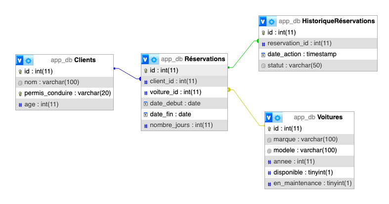

# EVAL 2 - Les triggers SQL
[]()

## Contexte
Vous travaillez pour une entreprise qui gère un système de location de voitures en ligne. Vous êtes chargé d'implémenter
des triggers pour automatiser certaines opérations critiques liées aux réservations et à la gestion du stock de véhicules.

### Schéma de la BDD de l'application



## Installation

Un fichier `docker-compose.yaml` est fourni, ainsi il suffit de démarrer les services.
Ce dernier importe automatiquement la base de données
- `docker compose up -d`

Vous pouvez ensuite accéder à PHPMyAdmin, à l'adresse suivante :
- [http://localhost:8081](https://localhost:8081)

## Missions

Dans cette partie, vous devez concevoir et implémenter plusieurs triggers pour automatiser les règles métier et assurer
l'intégrité des données dans votre base de données. 


### Triggers a implémenter:

- Trigger de Mise à Jour de la disponibilité des Voitures lors d'une Réservation
  - Lorsqu'un client effectue une réservation, la disponibilité de la voiture doit être mise à jour
- Trigger de Vérification de l'Âge du Client avant une Réservation
  - L'age minimum pour louer une voiture est de 21 ans
- Trigger de Vérification de la Validité du Permis de Conduire avant la création d'un nouveau client
  - Un numéro de permis de conduire doit être unique et est considére valide s'il a une longueur de 15 caractères alphanumériques (chiffres et lettres)
  - SQl propose une fonction `LENGTH()` qui permet de calculer la longueur d'une chaîne de caractères et une fonction `REGEXP` pour vérifier si une chaîne de caractères correspond à un motif donné ( exemple : `REGEXP '^[A-Z0-9]{8,12}$'`)
  - Si le client n'a pas de permis de conduire, il ne peut pas être ajouté à la base de données et un message d'erreur doit être renvoyé
- Trigger de Vérification de la Disponibilité de la Voiture avant une Réservation
  - Une voiture ne peut pas être réservée si elle est n'est pas disponible
- Trigger pour Éviter les Chevauchements de Réservations sur la Même Voiture
  - S'assurer qu'une voiture ne soit réservée par plusieurs clients pour des périodes qui se chevauchent. 

## Modalités de rendu
Dans une volonté de création d'une documentation future, créer un fichier `triggers-nom-prenom.md`dans lequel vous allez détailler
chaque trigger. 
Chaque trigger devra être accompagné d'une explication détaillée de son rôle, de son fonctionnement et du code SQL correspondant.

## Exemple de rendu

### 1. Trigger de Mise à Jour de la Disponibilité des Voitures lors d'une Réservation

- **Nom du Trigger** : `Nom_du_trigger`
- **Événement** : `AFTER INSERT` sur la table `nom_table`
- **Objectif** :
    - Indiquer les actions que doit effectuer le trigger

#### Code SQL :

```sql
CODE SQL DU TRIGGER

```


